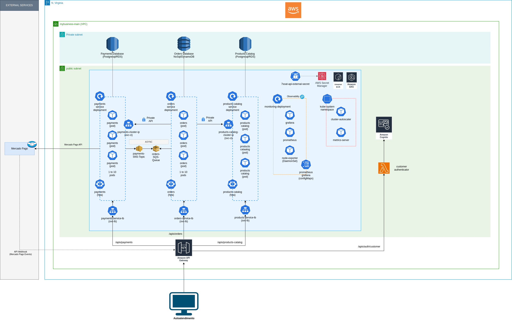
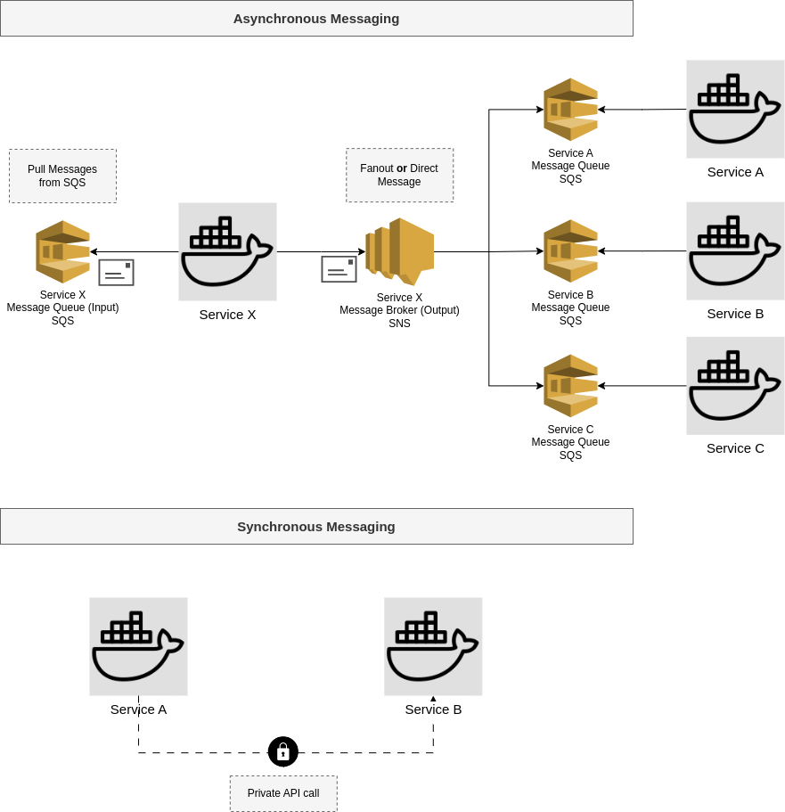

# Infrastructure

## Overview

<center></center>

<br>

- The infrastructure is deployed on AWS EKS.
- There is a VPC configured with 4 subnets: 2 public and 2 private.
- The Kubernetes cluster is in the 2 public subnets.
- The Services RDS Databases are in the 2 private subnets so that there is no way to have public access to it through the internet.
- Order, Payments and Products Catalog services deployed as pods on kubernetes;
- Customer authenticator deployed as a lambda function integrated with AWS cognito;
- Monitoring with grafana and prometheus and HPA + cluster-autoscaler for horizontal scaling;
- Asyncrhonous messaging with SNS+SQS;
- All infrastructure managed through terraform;

## Services
- **Payments Service**
  - Secrets from AWS secrets manager
  - Service docker image on amazon ECR
  - HPA to scale up to 10 containers
  - Integration with Mercado Pago as the payment broker
  - IAC at `k8s/payments-service`
  - 1 Relational Database on RDS
  - 1 SNS topic to publish async messages
  - Cluter ip service to allow private api calls and prometheus service discovery
- **Orders Service**
  - Secrets from AWS secrets manager
  - Service docker image on amazon ECR
  - HPA to scale up to 10 containers
  - IAC at `k8s/orders-service`
  - 1 NoSql table on dynamoDB
  - 1 SQS queue to receive messages
  - Cluter ip service to allow prometheus service discovery
- **Products Catalog Service**
  - Secrets from AWS secrets manager
  - Service docker image on amazon ECR
  - HPA to scale up to 10 containers
  - IAC at `k8s/products-catalog-service`
  - 1 Relational Database on RDS
  - 1 SQS queue to receive messages
  - Cluter ip service to allow private api calls and prometheus service discovery

## Monitoring
  - 1 Grafana pod instance.
  - 1 Prometheus pod instance.
  - Both use `emptyDir` for disk storage but can be evolved to use EBS for persistent data storage.
  - Node Exporter installed on each VM to monitor VM resources.

## Kube-system:
  - Some auxiliary services are installed in the kube-system namespace.
  - The Cluster Autoscaler monitors cluster compute resources and adjusts the AWS Auto Scaling Group to scale the cluster up and down according to resource usage.
  - Metrics Server allows HPA to monitor API pod resource usage and scale it up or down horizontally.

## External Services:
  - Mercado Pago: We use Mercado Pago to facilitate payments via Pix.

## Service Messaging Pattern

We've defined two possible patterns of communication between services and they are described bellow.

<center></center>

### Synchronous Messaging

This pattern implies that when Service A needs to synchronously communicate with Service B, it calls a private API of Service B. This approach should be used only when the following conditions are met:

- **Service B is the owner of the data that Service A needs** to complete the execution of a business rule.
- **Service A cannot obtain this data from other sources**, such as cache or locally replicated data from Service B.
- **The information must be obtained in real-time**, otherwise, Service A will not be able to successfully execute the related business rule.

## Asynchronous Messaging

In most scenarios, it is possible to send messages from Service A to Service B asynchronously. This is preferred over synchronous messaging because it allows for non-blocking communication.

We have defined that each service on the Guardian Partner platform will have an input queue from which it receives messages targeted to it and an output topic to which it publishes messages intended for one or more services:

- **Input Messaging Source**: This is the queue from which the service receives messages sent to it. In our current implementation, this is AWS SQS.

- **Output Messaging Target**: This is the message topic to which the service publishes messages. The service publishes the message once, and it is the topic's responsibility to deliver it to the interested services. In our current implementation, this is AWS SNS.

**Input messaging source**

Each service must have it own SQS queue for messages intended for it. The service will only process messages from this channel whose **target field** (see below) is the services' name.

**Output messaging source**

There are two possible scenarios for targeting a message sent by a service:

- **Scenario 1 to 1**: In this case a message sent by service A is exclusively targeted to service B and no other service should receive it.

- **Scenario 1 to N**: In this case a message sent by service A is sent to N other services (_fanout_);

We use an architecture with AWS SNS + SQS services to address both scenarios. It is a cloud-based system where Service A can publish a message once, and all interested services can receive this message automatically, without Service A needing to know the specific queues of these services, even though the message is targeted to just one single service.

In this model, once Service A publishes a message to its SNS topic, SNS automatically "forwards" this message to Services B, C, and D via their respective SQS queues, all configured within AWS. If at any point, a service no longer needs to receive messages from Service A, its corresponding SQS queue can simply be deregistered. Conversely, if a new Service E needs to start receiving these messages, its SQS queue can be linked to Service A's SNS topic.

To address the **1 to 1 scenario**, we explore the concept of _message filtering_ with Amazon SNS. This approach allows us to filter the target of messages published by a service, determining which SQS queue the message should be routed to. By implementing message filtering, we can ensure that only the intended recipients receive the messages, maintaining efficiency and clarity in our communication patterns.

**Messaging Pattern**

Messages exchanged through asynchronous channels must adhere to the following pattern:

```
{
  sender: XXXXXXXXXX
  target: XXXXXXXXXX
  type: MSG_XXXXXXXXXXXX
  payload: { }
}
```

- **sender**: The name of the service sending the message
- **target**: The name of the service receiving the message
- **type**: The message name.
- **payload**: The message data in json format

For messages that are intended to a set of services, the target must be **MSG_SERVICE_ANY**. When SNS identifies this target, it sends the message to all SQS queues listening to that SNS topic.

